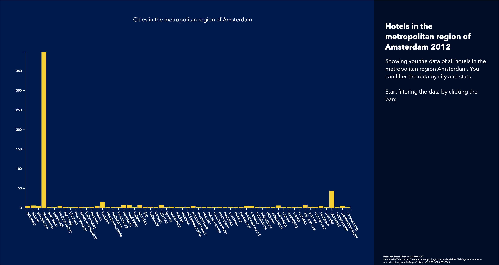

# Functional-programming
Resit of the frontend course Functional Programming

## The Visualisation
I chose to create a visualisation that shows the amount of hotels in the metropolitan region of Amsterdam. The presented graph contains three states that are all showing its own information. Every new state explores a deeper layer of data.

A working version can be found <a href="https://pimjenniskens.github.io/functional-programming/" target="_blank">here</a>

## Data 
The data I used to create the visualisation can be found here https://data.amsterdam.nl/#?dte=dcatd%2Fdatasets%2Fhotels_in_metropoolregio_amsterdam&dtfs=T&dsf=groups::toerisme-cultuur&mpb=topografie&mpz=11&mpv=52.3731081:4.8932945. 

The data is loaded with the `loadData()` function. The given data resulted in a .txt file which I had to clean and transform to make it readable and usable which resulted in the following steps (`prepareData()`): 
- Transforming the data into delimiter separated values,
- Filter the data to find empty values in the dataset and remove them,
- Map the data to return the necessary values in a new data array.

## Graph
The next step is to create a generic graph using `d3.js` (`updateUI()`) which can be used multiple times to show different data states. At first I made three different graphs to make sure every state was working, which I then later rewrote to one generic function to create the graph basics. 

### Important decisions in the graph funcion
- Provide `updateUI()` with the necessary generic paramaters (`dataGraph, graphTitle, tooltipLabel, xoffset, yoffset, rotation`), used for every three states
- Sort all data in alphabetical order,
- Scale the axes,
- Append the svg,
- Create tooltip,
- Make the bars clickable,
- Show transition on rectangle creation,
- Append the axes,
- Change graph title,
- Set the visibility of the back button.

## States
Every state in the graph has its own function: `showCityData(), showStarData() and showHotelData()`. Every function is given his own state which is called depending on the current `state` . 
Every of the three functions groups its data in another way. 
- `showCityData()` groups the data by the key City and the amount of hotels in that city. To count the amount of hotels I used the rollup() function.
- `showStarData()` groups the data by key stars and shows how many hotels have which star. I made sure that the selected city is being shown by filtering the data to show the corresponding element. This function also contains a function to add missing stars, so that the x-axis always shows the values 0, 1, 2, 3, 4 and 5. 
- `showHotelData()` groups the data by hotel name and amount of rooms inside the hotel. Again, I need to filter the data to make sure that only the hotels matching with the selected city and the selected star value are being shown. In this case, the key is the name of the hotel, and the value is 'room'. 
All of the three functions end with filling the `updateUI()` function with the necessary parameters. 

The application is started using the `init()` function. This sets the events handler for the click on the back button, loads and prepares the data and shows the initial graph. 
